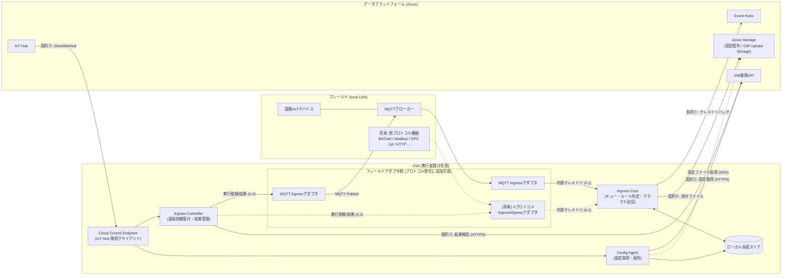

# データプラットフォーム連携ゲートウェイ(GW) 設計要件書【実行基盤非依存版】

| 項目 | 内容 |
|---|---|
| 文書名 | データプラットフォーム連携ゲートウェイ 設計要件書(実行基盤非依存版) |
| 版数 | 2.1 |
| 作成日 | 2026-08-28 |
| 対象システム | デジタルツインデータプラットフォーム(DTDPF) 連携ゲートウェイ |
| 位置づけ | 本書のみで実装着手可能なレベルの設計要件を定義する |

## 改版履歴

| 版 | 変更内容 |
|---|---|
| 1.0 | Azure IoT Edge 前提の設計要件書(資料・サンプルコードの統合) |
| 2.0 | **実行基盤を抽象化**し、クラウドとの外部契約(3章)および論理機能(5〜7章)を必須要件として再構成。**フィールド側接続プロトコルをアダプタ単位で追加可能**とする拡張モデル(6章)を導入。既存の Azure IoT Edge 構成は選択肢の一つとして付録A(参考)に保持 |
| 2.1 | 設計レビュー指摘の反映: **Durable Ingress Log(WAL)** による異常終了時のデータ保証と「at-least-once + `id` 冪等」モデルの明文化([ING-16][ING-17][C1-08])、EventHubs **Partition Key と順序保証スコープ**([C1-07])、Egress の**直列化・taskId 冪等・タイムアウト整合**([EG-05]〜[EG-07][C2-07][C2-08])、設定スナップショットの**世代切替**([CFG-09])、ルール判定時刻の **EventTime セマンティクス**([RULE-07][RULE-08])、protocol 解決の規範化([ADP-11])、MQTT セッション要件と保証境界([MQI-04][NF-16])、ファイル添付の閾値・上限超過時動作の定義([C4-05]〜[C4-07])、認証トークンの時刻窓・暗号移行方針([C3-03][NF-17]) |

## 参照資料

| # | 資料 | 反映内容 |
|---|---|---|
| 1 | ゲートウェイ設計書 (2020-04-03) | GW全体構成、設定配信フロー |
| 2 | 2021年度対応 主な変更点 (2021-12-20) | テレメトリ/ルールフォーマット、EventHubs送信化 |
| 3 | NEDO2021年対応 GW関連補足説明資料 (2022-01-19) | モジュール構成、Egressダイレクトメソッド仕様 |
| 4 | テレメトリデータのファイル添付機能について (2021-11-05) | ファイル添付仕様 |
| 5 | サンプルコード dtdpf-gateway_20211130 (C# / Azure IoT Edge) | 詳細処理仕様、IF定義(→付録A) |

---

## 1. システム概要

### 1.1 目的

建物設備・IoT機器からセンシングされたデータを、現場に設置したゲートウェイ(GW)で受信・正規化・ルール判定し、クラウド上のデータプラットフォーム(Azure)へ送信する。また、クラウドからの遠隔制御(エグレス)要求を受信し、フィールド側へ制御を配信して結果をクラウドへ報告する。

### 1.2 設計方針(v2.0 の基本原則)

- [PRN-01] **実行基盤非依存**: GW側の実行基盤(Azure IoT Edge、汎用コンテナ基盤、単一常駐プロセス等)は要件としない。必須要件は「クラウドとの外部契約(3章)」と「論理機能(5〜7章)」であり、それらを満たす任意の基盤・言語で実装してよい。
- [PRN-02] **外部契約の固定**: プラットフォーム側との互換性は 3章の外部契約のみで担保する。GW内部の構成を変更してもプラットフォーム側の変更は不要であること。
- [PRN-03] **フィールドプロトコルの拡張性**: フィールド側(設備・デバイス側)との接続は「フィールドアダプタ」として分離し、プロトコルごとにアダプタを**追加・交換可能**とする(6章)。初期実装は MQTT アダプタとする。
- [PRN-04] **エッジでのルール判定**: リアルタイム処理・負荷分散のため、ルール判定(クラウド実行分を含む)は GW 側で行い、判定結果をテレメトリに付加してクラウドへ送る(旧設計からの継承方針。実行基盤とは独立したアプリケーション設計方針である)。
- [PRN-05] **参考構成の保持**: 既存の Azure IoT Edge によるモジュール分割構成・デプロイ定義は付録Aに参考として記載する。IoT Edge を採用する場合は付録Aのバインディングをそのまま利用できる。

### 1.3 実行環境の前提(最小要件)

| 項目 | 要件 |
|---|---|
| ハードウェア | Linux が動作する現場設置型ゲートウェイ機器(参考: OKI AE2100)。特定機種は要件としない |
| ネットワーク | フィールド側 LAN への接続、およびクラウド(Azure)への outbound 接続(AMQP 5671/tcp または AMQP over WebSocket 443/tcp、MQTT 8883/tcp または同等、HTTPS 443/tcp) |
| ローカル永続ストア | 設定ファイル・未送信テレメトリ退避・添付ファイルを保持できる永続領域(ファイルシステム、組込DB、ローカルBlob等。方式は問わない) |
| プロセス管理 | GW再起動時の自動起動、異常終了時の自動再起動(systemd / Docker restart policy / IoT Edge 等、方式は問わない) |

---

## 2. 全体アーキテクチャ(論理構成)

### 2.1 論理コンポーネント構成図



### 2.2 論理コンポーネント一覧

| 論理コンポーネント | 必須 | 責務 | 既存構成での対応(参考) |
|---|---|---|---|
| フィールドIngressアダプタ | ○(1種以上) | フィールドプロトコルでデータを受信し、正規化して内部テレメトリ(4.1)として Ingress Core へ渡す | `ingressmqtt` モジュール |
| フィールドEgressアダプタ | ○(1種以上) | Egress Controller からの実行依頼(4.2)を受け、フィールドプロトコルで制御を配信し結果を返す | `egressmqtt` モジュール |
| Ingress Core | ○ | 内部テレメトリのキューイング、ポイント突合、ルール判定、クラウド送信 JSON 生成、EventHubs バッチ送信、添付ファイル処理、未送信分の永続化 | `ingress` モジュール |
| Egress Controller | ○ | `setProperty` の受付、対象ポイント解決、アダプタへの実行依頼、応答/一時受付(202)管理、GW連携APIへの結果報告 | `egress` モジュール |
| Config Agent | ○ | GW連携APIからの設定取得、外部→内部フォーマット変換、ローカル設定ストアの更新、`configUpdateNotify` の受付 | `fileupdate` モジュール + 各モジュール内 ConfigUpdateService |
| Cloud Control Endpoint | ○ | IoT Hub への接続維持と DirectMethod の受付・各コンポーネントへのディスパッチ、ツインによる設定・状態報告 | 各モジュールの ModuleClient(モジュール単位に分散) |
| ローカル永続ストア | ○ | 設定ファイル・テレメトリバックアップ・添付ファイルの保持 | `configstorage`(Azure Blob Storage on IoT Edge) |
| メッセージング/実行基盤 | -(方式自由) | コンポーネント間のデータ受け渡しと、コンポーネントの配置・起動管理 | Azure IoT Edge (edgeHub Route + edgeAgent) |

- [ARC-01] 論理コンポーネントの**プロセス配置は自由**とする。許容例: (a) 単一プロセス内のプラグイン構成、(b) プロセス/コンテナ分割 + ローカルメッセージング、(c) Azure IoT Edge モジュール分割(付録A)。
- [ARC-02] ただしコンポーネント間の受け渡しデータは 4章の内部契約に従うこと(配置を後から変更可能にするため)。
- [ARC-03] Cloud Control Endpoint は論理的に一つの機能だが、実装上は各コンポーネントが個別に IoT Hub クライアントを持つ形(既存構成)でも、単一クライアントでメソッド名によりディスパッチする形でもよい。**クラウド側のメソッド呼び出し宛先(デバイス宛/モジュール宛)と整合させること**(3.3.1 の注意参照)。

### 2.3 信頼性モデル(イングレスデータプレーン)

イングレス経路は次のパイプラインを規範とする。受理時点の永続化と送達確認後のコミットにより、異常終了(電源断・強制終了)を跨いだ at-least-once を保証する(詳細: [ING-16][ING-17][C1-07][C1-08])。

```text
フィールドアダプタ
   ↓ 正規化テレメトリ (4.1)
Durable Ingress Log / Outbox   ← 受理 = 永続化完了時点 (ここから at-least-once 保証)
   ↓
ルール判定・変換 (5.2)
   ↓
Event Hubs 送信 (Partition Key = rootId)
   ↓ 送信 Ack
Outbox コミット (削除 / 送信済み遷移)
```

重複送達はクラウド側のテレメトリ `id` による冪等処理で吸収する。フィールド〜アダプタ受理前の保全はプロトコル・デバイス側能力に依存する([NF-16])。

---

## 3. 必須外部契約(プラットフォーム互換性要件)

本章がプラットフォーム側との互換性を定める**規範(normative)仕様**である。GW実装は基盤・言語によらず本章を満たさなければならない。

> 契約一覧: **① テレメトリ送信(EventHubs)/ ② 遠隔制御・設定更新通知(IoT Hub DirectMethod)/ ③ GW連携API(HTTPS)/ ④ ファイル添付(GW Upload Storage への到達)**
>
> ①はGWの主機能そのものであり当然に必須、②〜④がクラウド側システムとの取り決め(認証・宛先・書式)を要する契約である。

### 3.1 契約①: テレメトリ送信(GW → EventHubs)

- [C1-01] テレメトリは Azure Event Hubs へ AMQP で**バッチ送信**する(IoT Hub のテレメトリ送信は使用しない)。トランスポートは AMQP/TCP を既定とし、環境に応じて AMQP over WebSockets を選択可能とする。
- [C1-02] EventData の ContentType は `application/json`、CorrelationId にはテレメトリ `id` を設定する。

#### 3.1.1 Body 部(JSON, UTF-8)

```jsonc
{
  "id": "43217568-443d-4b24-96d1-59887fdd1628",  // テレメトリごとに生成する GUID 文字列(小文字)。一意
  "type": 1,                                      // BACnet値タイプ (1:計量, 2:計測, 3:状態, 4:警報。5以降はユーザー定義)。null許容
  "rootId": 5,                                    // デジタルツインルートID(建物ID)。整数
  "dtId": "R90_000001",                           // ツインID(ポイントID)
  "topic": "takenaka.co.jp/R90/west/2F/-/...",    // 物理側アドレス (フィールドアダプタ固有のアドレス文字列)
  "eventTime": "2021-07-01T01:23:45.1234567Z",    // テレメトリ生成時刻 (ISO8601 UTC, ラウンドトリップ形式)
  "values": {                                     // テレメトリ値オブジェクト
    "value": "256.3"                              // 必須。テレメトリ代表値(サマリ値)。その他キーは任意
  }
}
```

- [C1-03] `id` は都度 GUID(v4) を新規生成し小文字で格納。`values.value` は必須。
- [C1-04] 旧フォーマットの `pointId`・`sequenceNumber` キーは出力しない(廃止)。
- [C1-05] `type` はポイント設定の値を転記。未設定時は null 可(省略可)。

#### 3.1.2 Property 部(EventData アプリケーションプロパティ。Key/Value とも文字列)

| プロパティ | 設定条件 | 内容 |
|---|---|---|
| `rootId` | 常時 | デジタルツインルートID |
| `dtId` | 常時 | ツインID |
| `action` | クラウド実行ルール合致時のみ | `"1"` 固定 |
| `actionIds` | 同上 | 対象アクションIDの `\|` 区切り配列(重複除去)。例 `"1\|10"` |
| `ruleIds` | 同上 | 合致ルールIDの `\|` 区切り配列。例 `"2\|3"` |
| `fileUpload` | ファイル添付時のみ | `"1"` |
| `fileName` | ファイル添付時のみ | `"{Body id値}.{拡張子}"` |
| `fileHash` | ファイル添付時のみ | 添付ファイルの SHA256 ハッシュ文字列 |
| `ingressRcvTime` / `ingressFwdTime` / `mqttModuleFwdTime` | トレース用 | 各中継点の時刻(ISO8601)。`mqttModuleFwdTime` はアダプタ転送時刻(名称は互換維持のため既存のまま) |

- [C1-06] `action`/`actionIds`/`ruleIds` は**クラウド側実行(または両方実行)ルールに合致したテレメトリにのみ**セットする。旧 `eventHubs_x` プロパティは廃止。

#### 3.1.3 配信セマンティクスとパーティショニング

- [C1-07] **Partition Key と順序保証スコープ**: EventHubs 送信時は Partition Key を明示する。既定は `rootId`(文字列化)とし、構成で `deviceId` 単位へ変更可能とする。順序保証のスコープは「同一 Partition Key 内」に限定し、GW は同一 Partition Key に属するテレメトリを受付順(内部シーケンス番号順)で投入する。異なる Partition Key 間の順序は保証しない。EventDataBatch は Partition Key ごとに作成する。
  - 留意: 1 つの Partition Key は単一パーティションのスループット上限に律速される。rootId 単位の想定流量がパーティション上限を超える場合は、キー設計(例: rootId+dtId ハッシュ)をプラットフォーム側と再協議する。
- [C1-08] **配信保証**: GW→EventHubs の配信保証は **at-least-once** とする。障害復旧時の再送により同一テレメトリが重複到達しうるため、クラウド側はテレメトリ `id`(GUID)による重複排除(冪等処理)を前提とすること(要プラットフォーム側合意)。GW 内部シーケンス番号は Body に出力せず、GW 内の整列・送信制御にのみ使用する([C1-04] と整合)。

### 3.2 契約②: 遠隔制御・設定更新通知(IoT Hub DirectMethod)

- [C2-01] GW は Azure IoT Hub にデバイス(またはモジュール)として常時接続し、以下 3 メソッドを受け付けること。

| メソッド名 | 受付コンポーネント | 内容 |
|---|---|---|
| `setProperty` | Egress Controller | 遠隔制御(値書き込み)要求 |
| `invokeAction` | Egress Controller | WoT アクション実行(将来拡張)。**501 (MethodNotImplemented)** + `status:"fail"` を返す |
| `configUpdateNotify` | Config Agent | 設定情報の更新通知。受付後 `status:"receive"` / **202** を返し非同期で更新実行 |

- [C2-02] **メソッド宛先の整合(要クラウド側協議)**: 既存構成ではクラウドは「デバイスID+モジュールID(egress / fileupdate)」宛にメソッドを呼び出す。実行基盤を変更する場合は次のいずれかとする。
  - (a) クラウド側を**デバイス宛メソッド呼び出し**に変更し、GW は単一の IoT Hub デバイスクライアントで 3 メソッドを受けてディスパッチする(メソッド名は重複しないため衝突しない)。
  - (b) GW 側が既存のモジュールID(`egress` / `fileupdate`)を名乗るモジュールクライアントを維持し、クラウド側は無変更とする(IoT Edge でなくてもモジュールIDでの接続は可能)。
- [C2-03] `setProperty` リクエスト Body:

```jsonc
{
  "taskId": 43,                                          // Egress タスクID (long)
  "rootId": 2,                                           // デジタルツインルートID
  "dtId": "R90_000001",                                  // 対象ツインID
  "values": { "value": 30 },                             // 遠隔制御値 (value 必須)
  "publishDatetime": "2021-11-30T09:15:40.4333166+09:00",// タスク発行日時 (ISO8601)
  "publishClientId": "00003",                            // 実行クライアントID
  "correlationId": "80005b5d-0000-b500-b63f-84710c7967bb"// トレースID
}
```

- [C2-04] メソッドレスポンス Body(共通):

```jsonc
{ "status": "success", "detail": { }, "correlationId": "..." }  // status: "success" | "fail" | "receive"
```

| ケース | status | HTTPステータス |
|---|---|---|
| フィールド実行成功 | `success` | 200 |
| リクエスト不備(rootId/dtId 未登録等)・実行結果 BadRequestError | `fail` | 400 |
| システムエラー | `fail` | 500 |
| シャットダウン中 | `fail` | 503 |
| `invokeAction` | `fail` | 501 |
| **タイムアウト(既定20秒)以内に結果未着 → 一時受付** | `receive` | **202** |

- [C2-05] 202 応答後にフィールド実行結果が確定した場合は、契約③の Egress 結果報告 API へ結果を報告する。
- [C2-06] タイムアウト時間は設定値 `EgressTimeoutSec`(既定 20 秒)とする。
- [C2-07] **タイムアウト整合**: クラウド側のダイレクトメソッド呼び出し設定は `responseTimeoutInSeconds > EgressTimeoutSec + 通信マージン` とすること(推奨: GW 20 秒に対し 30 秒以上。IoT Hub の設定範囲は 5〜300 秒、既定 30 秒)。これを満たさないと、GW が 202 を返す前にクラウド側がタイムアウト(504)する構成が生じうる。
- [C2-08] **冪等性**: 同一 `taskId` の `setProperty` 再送要求は二重実行しない(GW側要件 [EG-06])。クラウド側は再試行時に同一 `taskId` を使用すること。

### 3.3 契約③: GW連携API(GW → クラウド, HTTPS)

#### 3.3.1 認証(共通)

- [C3-01] 以下 JSON トークンを **AES-256-CBC(PKCS7、ブロック128bit)** で暗号化し Base64 化してヘッダーに付与する。IV はリクエストごとに生成する。

```jsonc
{ "deviceId": "{デバイスID}", "moduleId": "{モジュールID}", "createDatetime": "2021-..." }
```

| ヘッダー | 値 |
|---|---|
| `X-DTDPF-GW-ACCESS-TOKEN` | トークン暗号文の Base64 |
| `X-DTDPF-GW-ACCESS-IV` | IV の Base64 |

- 鍵は設定値 `ApiSecureKey`(Base64、32byte)で注入する。
- `deviceId` は IoT Hub デバイスID。`moduleId` は既存互換値(`egress` / `fileupdate` 相当)を送る。単一プロセス実装でも呼び出し用途に応じた moduleId を設定してよい(クラウド側の検証仕様に合わせる)。
- **注意**: サンプルコードは IV ヘッダーに誤って暗号文を設定している(付録A.7)。本実装は IV を設定するが、**クラウド側の現行検証実装がバグ互換になっていないか事前確認**すること。
- [C3-02] HTTP 5xx 応答時は指数バックオフ(`min(2^(n-1), 15) + jitter(0〜1)` 秒)で最大 5 回リトライする。
- [C3-03] (推奨・要クラウド側協議)トークンの `createDatetime` に許容時間窓(例: `|サーバ現在時刻 - createDatetime| <= 5 分`)を設け、期限外トークン・再利用トークンを拒否する。不正 padding 等の復号エラーは詳細を区別しない統一エラーで応答する。また AES-CBC は単体では改ざん検知(メッセージ認証)を持たないため、契約更改時には AES-GCM(または AES-CBC + HMAC)への移行を推奨する([NF-17])。現行クラウド実装との互換確認が取れるまでは現方式を維持する。

#### 3.3.2 GW設定情報取得 API

- `GET {GatewayInfoApiEndpoint}?deviceId={デバイスID}`
- レスポンス(抜粋。完全形は 5.4.2 の取込仕様とあわせて用いる):

```jsonc
{
  "groups": [
    {
      "groupId": 1,
      "roots": [
        {
          "rootId": 5,
          "rootName": "R90",
          "pointsUpdateDatetime": "2021-...",            // null可
          "points": "https://.../points.json?sig=...",   // ポイントファイル SAS URI
          "rulesUpdateDatetime": "2021-...",              // null可
          "rules": [
            { "ruleId": 1, "cloudActionId": 10, "gatewayActionName": "mail",
              "fileUri": "https://.../rule_1.json?sig=...", "updateDatetime": "2021-..." }
          ]
        }
      ],
      "telemetryTypesUpdateDatetime": "2021-...",         // null可
      "telemetryTypes": [
        { "telemetryTypeId": 1, "fileUri": "https://...", "updateDatetime": "2021-..." }
      ]
    }
  ],
  "createDatetime": "2021-...",
  "correlationId": "..."
}
```

#### 3.3.3 Egress 実行結果報告 API

- `POST {EgressReportApiEndpoint}`、Body (`application/json; utf-8`):

```jsonc
{
  "deviceId": "{デバイスID}",
  "taskId": 43,
  "status": "Success",     // "Success" | "BadRequestError" | "SystemError"
  "detail": { },
  "correlationId": "..."
}
```

### 3.4 契約④: テレメトリのファイル添付

- [C4-01] クラウドへ送るテレメトリのデータサイズが **1KB を超える**場合、`values` に全データを格納せず、データ本体をファイルとして保存してクラウド側 **GW Upload Storage** に到達させ、テレメトリの Property に `fileUpload="1"` / `fileName` / `fileHash` を付加する(3.1.2)。
- [C4-02] ファイル名は `"{テレメトリBody id値}.{拡張子}"`(例: `43217568-...-59887fdd1628.json`)。最大サイズは **10MiB (10,485,760 byte)**。
- [C4-03] `values.value` にはサマリ値(代表値)を格納し、テレメトリ本体は 3.1.1 の通常フォーマットを維持する。
- [C4-04] **クラウドへの到達手段(バインディング)** は以下のいずれかとし、採用方式をプラットフォーム側と合意すること。

| バインディング | 方式 | 備考 |
|---|---|---|
| A: ローカルBlob自動同期(既存) | Azure Blob Storage on IoT Edge の deviceToCloudUpload で GW Upload Storage へ自動同期 | IoT Edge 採用時。付録A参照 |
| B: 直接アップロード | GW から GW Upload Storage へ直接 PUT(SAS または Entra ID 認証)。SAS の払い出しは GW連携API の拡張(要調整)または事前配布 | 基盤非依存。ネットワーク断時の再送キューを自前実装すること |

- [C4-05] **閾値の定義**: 「1KB 超」の判定は「`values` オブジェクトを UTF-8 のコンパクト JSON(空白なし)にシリアライズしたバイト長 > 1,024 byte」とする(テスト可能な固定定義)。
- [C4-06] **fileHash の表現**: SHA-256 ハッシュの**小文字16進文字列**(64文字)とする(要クラウド側確認。現行クラウド実装が異なる表現の場合はそちらに合わせる)。
- [C4-07] **上限超過時の動作**: 10MiB を超えるデータは添付を行わず、テレメトリ本体は `values` のサマリ値のみで送信する(`fileUpload` 系プロパティはセットしない)。超過発生はエラーログおよび状態報告(7.4)で通知する。分割(チャンク化)は行わない(必要になった場合はプラットフォーム側と別途協議)。

---

## 4. 内部契約(コンポーネント間インターフェース)

コンポーネントの配置(同一プロセス/別プロセス/別コンテナ)によらず、受け渡しデータは本章の論理形式に従う。**トランスポート(バインディング)は次のいずれでもよい**: (a) プロセス内キュー/関数呼び出し、(b) ローカルメッセージング(ローカルMQTTブローカー、Unix ソケット、gRPC 等)、(c) IoT Edge edgeHub Route(付録A)。

- [IC-01] プロセス間バインディングを用いる場合のシリアライズ形式: 内部テレメトリ(4.1)は **MessagePack**(高頻度・大量のため)、Egress 実行依頼/結果(4.2)は **JSON** とする。プロセス内バインディングではオブジェクトを直接受け渡してよい。
- [IC-02] いずれのバインディングでも at-least-once 配信を前提とし、受信側は再配信(重複)を許容する設計とする。

### 4.1 内部テレメトリ(Ingressアダプタ → Ingress Core)

| # | フィールド | 型 | 内容 |
|---|---|---|---|
| 1 | `Id` | GUID | テレメトリ固有ID(アダプタで新規生成) |
| 2 | `EventTime` | DateTimeOffset | テレメトリ時刻(UTC) |
| 3 | `RootId` | int | デジタルツインルートID |
| 4 | `Topic` | string | 物理側アドレス(ポイント設定の `topic` と一致すること) |
| 5 | `ValuesJsonData` | byte[] | values オブジェクトの JSON UTF-8 バイト列 |
| 6 | `OptionProperties` | map<string,string> | 追加プロパティ(クラウド送信時に Property へ転記)。アダプタ転送時刻 `mqttModuleFwdTime` を含む |

- [IC-03] MessagePack を用いる場合、フィールドの Key 番号は上表の # に固定する(1〜6。既存実装と互換)。
- [IC-04] アダプタはバッチ送信してよい(1受信イベントから生成した複数テレメトリは 1 バッチで送る)。

### 4.2 Egress 実行依頼・実行結果(Egress Controller ⇔ Egressアダプタ)

**実行依頼**(Controller → アダプタ)。契約②の `setProperty` Body に、ポイント設定から解決した `topic` を付加した形式:

```jsonc
{
  "taskId": 43, "rootId": 2, "dtId": "R90_000001",
  "topic": "takenaka.co.jp/R90/research/-/-/HVAC/TS/-/2AISSTCPD/Control/W",
  "values": { "value": 30 },
  "publishDatetime": "2021-11-30T09:15:40.4333166+09:00",
  "publishClientId": "00003",
  "correlationId": "80005b5d-0000-b500-b63f-84710c7967bb"
}
```

**実行結果**(アダプタ → Controller):

```jsonc
{
  "taskId": 43,
  "status": "Success",       // "Success" | "BadRequestError" | "SystemError" (文字列enum)
  "detail": { },             // 成功: 制御した dtId と値の辞書等 / 失敗: エラー情報
  "correlationId": "..."
}
```

- [IC-05] `correlationId` は依頼〜結果〜クラウド報告まで必ず透過させる。
- [IC-06] アダプタは実行失敗時に `SystemError`、依頼内容不備時に `BadRequestError` を返す(失敗を `Success` にしない)。

### 4.3 設定ストア読み取りIF(Config Agent → 各コンポーネント)

- [IC-07] Config Agent はローカル永続ストア上に 5.4.1 の設定4ファイル(JSON)を維持する。各コンポーネントは同ストアから設定を読み込む。ストアの実体はファイルシステム/ローカルBlob等いずれでもよいが、**「configInfo(更新日時インデックス)を先に読み、差分のあるファイルのみ再読込」**という更新検知プロトコルを共通とする。
- [IC-08] プロセス内配置の場合は、ストア経由の代わりに Config Agent がメモリ上の設定オブジェクトを Reader-Writer ロック付きで直接公開する方式でもよい(その場合もファイルへの永続化は行い、再起動時に復元できること)。

---

## 5. 機能要件(コア機能)

### 5.1 Ingress Core

#### 起動・復元

- [ING-01] 有効なポイント設定が読み込めるまで待機してから受信処理を開始する。
- [ING-02] 起動時、Durable Ingress Log([ING-16])上の未送信レコードを読み出し、`EventTime` 昇順で処理キューへ復元する(v1.0 の「終了時一括バックアップ」方式は廃止し、常時永続ログを正本とする)。
- [ING-03] EventHubs Producer を開始する(契約① [C1-01])。

#### 受信・キューイング

- [ING-04] 未送信レコード数(Durable Ingress Log 上の滞留件数)が上限(`MaxReceiveQueueLength`、既定 1,000,000)を超える間は受信側を待機させる(背圧制御)。上限値はログ格納域の容量見積もり(上限件数 × 平均レコード長)と整合させること。
- [ING-05] 受信時に `ingressRcvTime`(ISO8601)を OptionProperties へ追加する。
- [ING-06] 不正データ(デシリアライズ不能等)はログのうえ破棄し、処理を継続する(ポイズンメッセージで停止しない)。

#### 永続化(Durable Ingress Log / Outbox)

- [ING-16] **Durable Ingress Log**: Ingress Core は内部テレメトリを**受理した時点で**ローカル永続キュー(WAL / append-only log / 組込DB(SQLite WAL、RocksDB 等)のいずれか。実装方式は問わない)へ記録し、記録の永続化(fsync 相当)完了後にアダプタへの受理応答(バインディングの Ack/Complete)を返す。EventHubs からの送信成功(Ack)確認後に当該レコードを削除または送信済み状態へ遷移させる。電源断・強制終了(kill -9 / OOM kill / ランタイム障害)後も未送信レコードを復元できること。メモリ上のキューは永続ログのビューであり、**正本は永続ログ**とする。
  - 実装補足: 書込みスループットとフラッシュ媒体(eMMC/SD)の寿命への配慮として、fsync はグループコミット(複数レコードをまとめて 1 回同期。最大遅延は構成値、目安 100ms 程度)としてよい。**受理応答を fsync 完了後に返す限り at-least-once は維持される**(遅延が増えるだけで保証は崩れない)。
- [ING-17] **再送と重複**: 送信成功のコミット前に異常終了した場合、復旧後に同一テレメトリが再送される(at-least-once)。重複排除はクラウド側の `id` 冪等処理に委ねる([C1-08])。GW は再送時も同一 `id`・同一 Body を維持する(再生成しない)。

#### ルール判定・送信ループ

- [ING-07] キューから滞留分をまとめて取り出し 1 バッチとして処理する。各テレメトリに単調増加のシーケンス番号を割り当て、送信順序の整列に用いる。
- [ING-08] ポイント突合: `pointConfig.pointData[rootId]` から `topic` 完全一致でポイントを解決。未登録の rootId / topic のテレメトリは破棄(ログ出力)。
- [ING-09] クラウド送信 JSON(3.1.1)を生成し、Property に OptionProperties 全件 + `rootId` + `dtId` を転記する。
- [ING-10] ルール判定(5.2)を実施し、クラウド実行ルール合致時は `action`/`actionIds`/`ruleIds` を付与、GW実行ルール合致時は GW側アクションへ転送する(アクション名→転送先のマップは GW 構成定義で与える。未定義のアクション名は転送しない)。
- [ING-11] バッチ内並列処理を許容するが、EventHubs への投入順はシーケンス番号順を保つ。EventDataBatch のサイズ上限に応じて自動分割送信し、各メッセージに送信直前の `ingressFwdTime` を付与する。
- [ING-12] 1KB 超のデータは契約④(3.4)に従いファイル添付化する。
- [ING-13] 処理ループ内の例外はログ出力後 5 秒待機して自動再開する。

#### 停止・退避

- [ING-14] 停止要求時は「受信停止 → 処理中バッチの送信完了(またはコミット)→ 接続クローズ」の順で終了する。未送信レコードは Durable Ingress Log に残置し、次回起動時に復元する([ING-02]。終了時の一括退避処理は不要)。

#### 状態報告

- [ING-15] 処理開始日時・累積処理数・設定更新日時を、IoT Hub ツイン reported(または同等の監視手段)へ定期報告する(報告間隔は設定値。既定 300 秒、運用例 60 秒)。

### 5.2 ルール判定仕様

- [RULE-01] 判定対象は「基準時刻がルール適用期間内」のルールのみ。基準時刻は [RULE-07] に従いテレメトリの `EventTime` とする。
- [RULE-02] 適用期間判定:
  - 単発 (`scheduleType=1`): `startDatetime < 現在時刻 < startDatetime + durationHour 時間`
  - 定期 (`scheduleType=2`): ①`startDatetime < 現在時刻 < endDatetime`、②`startDatetime` の UTC オフセットを適用したローカル時刻の曜日が `dayOfWeeks` に含まれる、③そのローカル時刻の時刻部分が `startDatetime の時刻部分`〜`+durationHour 時間` の範囲内、のすべてを満たす
- [RULE-03] 対象判定: ルールの `twins` に `dtId` が含まれ、かつ `conditions` の全条件(AND)を満たすこと。
- [RULE-04] 条件判定: values JSON 直下の `keyName` プロパティを取得し、
  - Number: 条件値・実測値とも decimal 化して「実測値 演算子 条件値」で比較(例: Less は 実測値 < 条件値)。変換不能は不一致。
  - String: 文字列比較。Contain/Start/End は実測値が条件値を含む/で始まる/で終わる。
  - `keyName` 不存在は不一致。
- [RULE-05] 実行場所振り分け: `site=Cloud(2)/Both(3)` → クラウドアクション(プロパティ付与)。`site=Gateway(1)/Both(3)` → GWアクション転送。
- [RULE-06] 複数ルール合致時、`actionIds`(cloudActionId、重複除去)・`ruleIds` は `|` 区切りで連結する。
- [RULE-07] **判定時刻セマンティクス(EventTime)**: スケジュール適用期間([RULE-01][RULE-02])の判定基準時刻はテレメトリの `EventTime` とする。障害復旧後の滞留データ再処理でも「発生時点」の時間条件で判定される(ProcessingTime 判定は行わない)。ルールセット自体は判定時点でロード済みの最新設定を用いる(ルール履歴の遡及適用は行わない)。
- [RULE-08] **再処理時のGWアクション抑止**: GW側アクション(site=Gateway/Both)は、`現在時刻 - EventTime` が鮮度閾値(構成値 `GatewayActionMaxAgeSec`、既定 300 秒)を超えるテレメトリに対しては実行しない(復旧時の滞留データ再処理による通知・制御の再実行防止)。クラウド向けの `action`/`actionIds`/`ruleIds` プロパティ付与は抑止しない(判定結果は常に付加し、実行可否はクラウド側で判断できるようにする)。

条件演算子・値種別の列挙値:

| condition | 意味 | 適用型 | | valueType | 意味 |
|---|---|---|---|---|---|
| 1 | Equal (=) | 数値/文字列 | | 1 | Number(decimal比較) |
| 2 | Less (<) | 数値のみ | | 2 | String |
| 3 | Greater (>) | 数値のみ |
| 4 | LessEqual (<=) | 数値のみ |
| 5 | GreaterEqual (>=) | 数値のみ |
| 6 | NotEqual (!=) | 数値/文字列 |
| 7 | Contain | 文字列のみ |
| 8 | Start (前方一致) | 文字列のみ |
| 9 | End (後方一致) | 文字列のみ |

### 5.3 Egress Controller

- [EG-01] 契約② `setProperty` を受け付け、以下を実施する。
  1. Body を検証・ログ出力。シャットダウン中は 503。
  2. pointConfig から `rootId`+`dtId` でポイントを解決し `topic` を取得。未登録は 400。
  3. ポイントに対応する**プロトコルのEgressアダプタ**を選択(6.3)し、実行依頼(4.2)を送信。
  4. `correlationId` をキーに結果待ちリストへタイムアウト期限付きで登録し、期限まで結果到着を待機。
  5. 到着した結果を [C2-04] のマッピングでメソッド応答。期限までに未着なら `receive`/202 で一時受付応答。
- [EG-02] アダプタからの実行結果を受信し、結果待ちが期限内なら格納([EG-01]-5 が応答)、期限切れ/不在なら契約③の結果報告 API へ POST する。
- [EG-03] `invokeAction` は 501 固定応答。
- [EG-04] 202 応答済みエントリはメモリリーク防止のため、結果報告完了時または一定期間(推奨: タイムアウトの10倍程度)経過時に削除する。
- [EG-05] **直列化**: 同一物理ポイント(`rootId`+`dtId`)への Egress 要求は到着順に直列実行する。異なるポイントへの要求は並行実行してよい(DirectMethod 呼び出し間の順序・並行性は IoT Hub 側では保証されないため、GW 側で保証する)。直列化待ちにより [C2-06] のタイムアウトを超過した要求は通常どおり 202(一時受付)へ移行する(仕様として許容)。
- [EG-06] **taskId 冪等性**: 同一 `taskId` の要求を受信した場合は二重実行せず、実行済み(または実行中)の結果を応答する。処理済み `taskId` は永続的な冪等ウィンドウ(構成値、既定 24 時間)で保持し、GW 再起動を跨いで有効とする。
- [EG-07] **202後結果の耐障害性**: 202 応答後に確定した実行結果は、契約③への報告完了まで永続キューに保持し、GW 再起動を跨いで報告を再試行する(結果の消失防止)。

### 5.4 Config Agent

#### 5.4.1 ローカル設定ファイル(設定ストア)

| ファイル名 | 内容 |
|---|---|
| `configInfo.json` | 各設定の最終更新日時(差分検知インデックス) |
| `pointConfig.json` | ポイントツイン設定 |
| `ruleConfig.json` | イングレスルール設定 |
| `telemetryTypeConfig.json` | テレメトリタイプ(JSON Schema)設定 |

**configInfo.json**

```jsonc
{
  "updateDatetime": "2021-...", "correlationId": "...",
  "pointDataUpdateDatetime": "2021-...",          // null可
  "ruleDataUpdateDatetime": "2021-...",           // null可
  "telemetryTypeDataUpdateDatetime": "2021-..."   // null可
}
```

**pointConfig.json**

```jsonc
{
  "updateDatetime": "2021-...", "correlationId": "...", "pointDataUpdateDatetime": "2021-...",
  "pointData": {                    // Key: デジタルツインルートID
    "5": [
      {
        "dtId": "R90_000001",
        "topic": "takenaka.co.jp/...",   // 物理側アドレス
        "typeId": 1,                     // テレメトリタイプID
        "type": 2,                       // BACnet値タイプ (null時は省略)
        "protocol": "mqtt"               // 【v2.0拡張】フィールドプロトコルID。省略時 "mqtt" (6.3)
      }
    ]
  }
}
```

**ruleConfig.json**(GW内部フォーマット)

```jsonc
{
  "updateDatetime": "2021-...", "correlationId": "...", "ruleDataUpdateDatetime": "2021-...",
  "ruleData": {                     // Key: デジタルツインルートID
    "5": [
      {
        "ruleId": 1, "ruleName": "ingressRuleAlertMail",
        "site": 2,                  // 1:Gateway 2:Cloud 3:Both
        "actionId": 10,             // クラウド実行アクションID (site=2,3)
        "actionName": "mail",       // GW実行アクション名 (site=1,3)
        "scheduleType": 2,          // 1:単発 2:定期
        "startDatetime": "2020-06-01T08:00:00+09:00",
        "durationHour": 8,
        "endDatetime": "2020-06-01T23:00:00+09:00",  // 定期のみ
        "dayOfWeeks": [0, 3, 6],                     // 定期のみ。日:0〜土:6
        "twins": ["R90_000001", "R90_000002"],
        "conditions": [
          { "keyName": "value", "condition": 5, "valueType": 1, "value": "10" }
        ]
      }
    ]
  }
}
```

**telemetryTypeConfig.json**

```jsonc
{
  "updateDatetime": "2021-...", "correlationId": "...", "telemetryTypeDataUpdateDatetime": "2021-...",
  "telemetryTypeData": {            // Key: デジタルツインルートID
    "5": [ { "typeId": 1, "schema": "{...JSON Schema文字列...}" } ]
  }
}
```

- `schema` は JSON Schema 文字列。`properties.values.required`(必須キー配列)と `properties.values.properties.{key}.type` を values 構成に用いる(6.2)。

#### 5.4.2 設定更新処理

- [CFG-01] 契機は 2 系統: (a) `AutoUpdateIntervalSec`(既定 300 秒)ごとの定期実行、(b) `configUpdateNotify` 受信。いずれも更新リクエストキューに積み、単一ワーカーが直列処理する(処理開始時に残リクエストをまとめて 1 回の更新にする)。
- [CFG-02] GW設定情報取得 API(3.3.2)から最新情報を取得し、ポイント(全 roots の最大)・ルール(全 roots の最大)・テレメトリタイプ(全 groups の最大)の各最終更新日時をローカル `configInfo.json` と比較して**種別ごとに独立に**更新要否を判定する(ローカル情報なしは全更新。null↔非null の変化、日時前進はいずれも更新要)。
- [CFG-03] ポイント取込: 各 root の `points` SAS URI からポイントファイル(下記)を取得し、`gatewayTwins[{自deviceId}]` のみ抽出。`formatId`→`typeId`、`telemeryType`→`type`(数値変換不能時 null)へマッピングして `pointConfig.json` を生成する。

```jsonc
// クラウド側ポイントファイル(外部フォーマット)
{
  "groupId": 1, "rootId": 5, "createDatetime": "2021-...", "correlationId": "...",
  "gatewayTwins": {                 // Key: デバイスID
    "gw-device-001": [
      { "dtId": "R90_000001", "topic": "takenaka.co.jp/...",
        "formatId": "1", "telemeryType": "2" }   // ※キー名は原文ママ
    ]
  }
}
```

- [CFG-04] ルール取込: 各 `rules[].fileUri` からルールファイル(下記)を取得し、内部フォーマットへ変換する。

```jsonc
// クラウド側ルールファイル(外部フォーマット)
{
  "ingressRuleName": "ingressRuleAlertMail",
  "rootId": 1,
  "executeSite": 2,                      // 1:GW, 2:クラウド, 3:両方
  "targetTelemetryId": 1,
  "action": {                            // 実行する Ingress アクション設定
    "type": 1,                           // 1:標準, 2:カスタム
    "name": "mail",
    "options": { "title": "rule mail {pointId}", "messageBody": "{pointId}\n{date}" }
  },
  "schedule": {
    "startDatetime": "2020-06-01T08:00:00+09:00",
    "durationHour": 8,
    "pattern": {                                   // 単発の場合は null
      "dayOfWeek": [0, 3, 6],
      "endDatetime": "2020-06-01T23:00:00+09:00"
    }
  },
  "targetDtIds": ["R90_000001", "R90_000002"],
  "conditions": [
    { "key": "value", "condition": ">=", "value": 10 }   // 演算子: =, <, >, <=, >=, !=, contain, start, end
  ],
  "comment": "ルールのコメント"
}
```

変換規則:
  - `pattern` 無し → `scheduleType=1`(単発)。有り → `scheduleType=2`(定期)。
  - 演算子マッピング: `"="→1, "<"→2, ">"→3, "<="→4, ">="→5, "!="→6, "contain"→7, "start"→8, "end"→9`。
  - `value` が JSON 文字列型なら `valueType=2`、数値なら `valueType=1`(値は文字列表現で保持)。
  - `ruleId`/`cloudActionId`(→`actionId`)/`gatewayActionName`(→`actionName`) は API 応答側の値を用いる。
- [CFG-05] テレメトリタイプ取込: 各 group の `telemetryTypes[].fileUri` から Schema 文字列を取得し、group 配下の全 root へ展開する。
- [CFG-06] 取込後、更新した種別のファイルと `configInfo.json` を設定ストアへ書き込む。書き込みは [CFG-09] の世代スナップショット方式で行い、読み手が中間状態や「種別間で世代の混在した組み合わせ」を読まないこと。
- [CFG-07] 各コンポーネント側は `ConfigUpdateIntervalSec`(既定 300 秒)間隔で configInfo の差分を確認し、**種別ごとに独立に**再読込する。読み書きは Reader-Writer ロックで排他する。初回読込完了までは各機能の主処理を開始しない。
- [CFG-08] ワーカー例外は 5 秒待機後に再開。APIリトライは [C3-02] に従う。
- [CFG-09] **設定スナップショットの世代切替**: 設定一式(4ファイル)は世代(generation)単位のスナップショットとして管理し、切替は「現在世代への参照の変更」1 操作のみをアトミックに行う。ファイルシステム実装例:

```text
config/
  generations/
    104/
      pointConfig.json
      ruleConfig.json
      telemetryTypeConfig.json
      configInfo.json          # 当該世代のマニフェストを兼ねる
  current -> generations/104   # アトミックな symlink 付け替え / rename で切替
```

  読み手は `current` の指す世代を 1 つの読み込み単位とする(読み込み途中で世代が切り替わっても、読みかけの旧世代ディレクトリは削除されないため一貫性が保たれる)。rename 相当の操作を持たないストア(ローカルBlob等)では「current ポインタファイルのアトミック更新」で代替する。旧世代は直近 N 世代(既定 3)を残して削除する。

---

## 6. フィールドアダプタ(プロトコル拡張モデル)

### 6.1 アダプタの構造

- [ADP-01] フィールドプロトコルとの接続は「Ingressアダプタ」(受信)と「Egressアダプタ」(制御配信)の対で実装する(受信のみのプロトコルは Ingress のみでよい)。
- [ADP-02] アダプタは**追加可能な配置単位**とする。プロセス分割構成ではアダプタ=独立プロセス/コンテナ、単一プロセス構成ではアダプタ=プラグインとし、いずれも 4章の内部契約のみで Core/Controller と接続する。Core・Controller 本体を変更せずにアダプタを追加できること。
- [ADP-03] アダプタの責務は「プロトコル固有の接続・受信・パース」と「内部契約への正規化」まで。ルール判定・クラウド送信はアダプタでは行わない。

### 6.2 Ingressアダプタ共通要件

- [ADP-04] 正規化手順(受信イベントごと):
  1. プロトコル固有のアドレス(MQTTならトピック)から物理側アドレス文字列 `topic` を決定する(1受信イベントから複数テレメトリに展開してよい)。
  2. `pointConfig.pointData[rootId]` から `topic` 完全一致でポイントを解決し、解決したポイントの `protocol`(解決規則は [ADP-11])が**自アダプタのプロトコルIDと一致すること**を照合する。未登録・プロトコル不一致はログのうえ破棄。
  3. ポイントの `typeId` で telemetryTypeConfig の JSON Schema を解決。Schema の `properties.values.required` の各キーを受信データから取り出し、`type` 指定(integer/double/string/object)に従って型変換して `values` を構成(integer は小数点付き実データを許容して浮動小数として扱う)。
  4. 内部テレメトリ(4.1)を生成(`Id`=新規GUID、`EventTime`=受信時刻UTC)し、アダプタ転送時刻プロパティを付与して Core へバッチ送信する。
- [ADP-05] パース・変換失敗は当該メッセージのみ破棄して継続する。
- [ADP-06] フィールド側接続の切断検知と自動再接続を行う(再試行間隔は既定 60 秒、運用構成では無限リトライ)。
- [ADP-07] アダプタ内のトピック展開・ペイロード解釈ロジック(パーサー)は差し替え・追加可能な構造(ストラテジ登録制)とする。

### 6.3 プロトコルルーティング(Egress)

- [ADP-08] pointConfig の各ポイントに **`protocol` フィールド(プロトコルID文字列)** を持たせる。省略時は `"mqtt"` とみなす(既存データとの後方互換)。
- [ADP-09] GW 構成定義に「プロトコルID → Egressアダプタ(バインディング先)」のルーティングマップを持つ。Egress Controller は対象ポイントの `protocol` でアダプタを選択して実行依頼を送る。該当アダプタが構成に無い場合は 400(`BadRequestError` 相当)を返す。
- [ADP-10] Ingress 側は各アダプタが自分の担当プロトコルのポイントのみ処理するため、ルーティングは不要(アダプタ→Core の一方向)。
- [ADP-11] **protocol 解決規則(規範)**: ポイントのプロトコルIDは次の優先順位で解決する。① クラウド配布ポイントデータの `protocol` フィールド(プラットフォーム側拡張後)、② GW ローカル構成定義の topic パターン→プロトコル マッピング、③ 既定値 `"mqtt"`。Ingress([ADP-04])・Egress([ADP-09])とも同一の解決結果を用いること。

### 6.4 リファレンス実装: MQTTアダプタ(初期スコープ・必須)

既存 `ingressmqtt` / `egressmqtt` の仕様を継承する。

#### MQTT Ingressアダプタ

- [MQI-01] 構成値(既存はモジュールツイン desired で配布。基盤に応じ構成ファイル等でも可):

| 設定 | 内容 | 例 |
|---|---|---|
| `rootId` | 建物ID | `5` |
| `mqttTargets` | 接続先ブローカー(カンマ区切り複数可) | `172.23.170.11,172.23.170.13` |
| `mqttTopics` | 各ブローカーに対応する Subscribe トピック | `#,takenaka.co.jp/#` |
| `distributeType` | 負荷分散種別(1:主要トピック / 2:その他)。複数アダプタインスタンスでの分散処理用 | `1` |

- [MQI-02] `mqttTargets[i]`+`mqttTopics[i]` を対にブローカーごとに並列 Subscribe(TCP/1883、Subscribe QoS2)。ブローカーごとに独立したクライアントインスタンスを保持する。
- [MQI-04] **セッションと保証境界**: MQTT 3.1.1 では固定 ClientId(GW・ブローカーごとに一意で再起動後も不変)+ CleanSession=false で接続する(MQTT 5 の場合は Clean Start=false + 十分な Session Expiry Interval)。再接続時に Subscription とブローカー側キューが復元されること。ただし切断中データの保持はブローカー側の永続セッション・キュー容量・message expiry 設定に依存するため、**接続断中に生成されたフィールドデータの保全範囲は「ブローカーの保持能力の範囲まで」**とし([NF-16])、案件ごとにブローカー設定をパラメータシートで確定する。
- [MQI-03] 受信 topic の部分一致でパーサーを振り分ける(現場デバイス構成に依存。以下は現行実装):

| 判定文字列 | パーサー | 概要 |
|---|---|---|
| `/Camera/mitsubishiele/Camera` | カメラ | JSON payload の `areas[]` を展開し、area ごとに topic 第10セクター(index 9)を `area_no_{n}_max` / `_min` に書換えて複数テレメトリ生成 |
| `/SoundPressure/R` | サウンド | `&` 連結 payload の `data`(JSON)と `value` を解析し、瞬時値 + Maximum/Minimum/Median/High/Low SoundPressure の 6 テレメトリを第10セクター書換えで生成 |
| `/Electricity/light/mitsubishiele/` | 照明 | `&` 連結 payload を展開し、元 topic と `{第10セクター}_max` / `_min` の 3 テレメトリを生成 |
| 上記以外 | その他 | `&` 連結 payload (`key=value&...`) を展開して 1 テレメトリ生成 |

#### MQTT Egressアダプタ

- [MQE-01] 構成値: `mqttTargets`(配信先ブローカー、カンマ区切り複数可)。
- [MQE-02] 実行依頼(4.2)を受け、`topic` へ以下ペイロードを全対象ブローカーに並列 Publish する(QoS1、Retain 無し):

```text
value={制御値}&datetime={実行時刻 ISO8601 JST(+09:00明示)}&publisher={publishClientId}
```

  - `values.value` が JSON 文字列型なら文字列値、それ以外(数値等)は raw テキストを設定する。
- [MQE-03] Publish 成否に応じて実行結果(4.2)を Controller へ返す(成功: `Success`、失敗: `SystemError`)。応答は Egress タイムアウト(20秒)内に収まる接続方式とする。
- [MQE-04] 処理失敗時の再試行はバインディングの再配信機構に従い、最大 10 回を超えたらドロップ(ログ出力)する。

### 6.5 アダプタ追加時の作業(拡張手順の定義)

新プロトコル(例: BACnet/IP、Modbus TCP、OPC UA、HTTP push)追加時に必要な作業は以下に限定されること。

1. プロトコルID を定義(例: `"bacnet"`)し、Ingress/Egress アダプタを 6.1〜6.3 に従って実装する。
2. GW 構成定義にアダプタの配置とルーティングマップのエントリを追加する。
3. 対象ポイントの `topic`(物理側アドレスの表現規約)と `protocol` を設定データに登録する。
4. 必要に応じて telemetryTypeConfig に新しいテレメトリタイプ(JSON Schema)を追加する。

→ Core / Controller / Config Agent / クラウド側のコード変更が発生しないこと([ADP-11] の配布拡張を除く)。

---

## 7. 非機能要件

### 7.1 性能

- [NF-01] プロセス間の内部テレメトリ転送は MessagePack バイナリを用いる([IC-01])。単一プロセス構成では直接受け渡しでよい。
- [NF-02] EventHubs へはバッチ送信し、投入順はテレメトリ受付順を保つ。
- [NF-03] 受信と送信処理はキューで分離し、キュー上限超過時は受信側を待機させる(データを落とさない)。

### 7.2 可用性・信頼性

- [NF-04] 全コンポーネント: 異常終了時の自動再起動(基盤の再起動機構)+処理ループ内例外の 5 秒待機自動再開の二段構えとする。
- [NF-05] Ingress Core が受理した以降のテレメトリは Durable Ingress Log([ING-16])により異常終了(電源断・強制終了を含む)を跨いで保全し、**at-least-once + `id` 冪等**([ING-17][C1-08])で送達する。
- [NF-06] クラウド断時: テレメトリは Durable Ingress Log に滞留させ、復旧後に順次送信する。プロセス間バインディングに store-and-forward がある基盤(edgeHub 等)ではそれも併用できるが、**保全の一次責任は Durable Ingress Log**とする(基盤非依存のため)。
- [NF-07] フィールド側接続は自動再接続([ADP-06])。クラウドAPIは指数バックオフリトライ([C3-02])。
- [NF-16] **保証境界**: 本書の at-least-once 保証は「Ingress Core が受理(永続化)した以降」に適用する。フィールド接続断中・アダプタ受理前に生成されたデータの保全は、各フィールドプロトコルおよびデバイス/ブローカー側の能力([MQI-04] 等)に依存する。

### 7.3 セキュリティ

- [NF-08] IoT Hub 接続資格情報・EventHubs 接続文字列・`ApiSecureKey`・ストレージキー等の秘匿値は構成機構(環境変数・シークレットストア)で注入し、コード・イメージへ埋め込まない。
- [NF-09] プロセスは非 root 実行を原則とする。
- [NF-10] ローカルメッセージング/ストアを用いる場合、GW 外部から到達できないよう bind 先を制限する(localhost / 内部ネットワークのみ)。
- [NF-17] GW連携API の暗号方式は互換契約として現行(AES-256-CBC)を維持しつつ、契約更改時には認証付き暗号(AES-GCM、または AES-CBC + HMAC)への移行を推奨する([C3-03])。

### 7.4 ログ・運用監視

- [NF-11] 構造化ログをコンソール(または syslog/journald)へ出力し、基盤側でローテーションする(参考: json-file 10m×3)。タイムスタンプは ISO8601。本番は Information 以上、開発は Debug 以上。
- [NF-12] IoT Hub ツイン reported(または同等手段)で報告する: 設定更新日時、処理開始日時、累積テレメトリ処理数。
- [NF-13] トレーサビリティ: 各中継点の時刻プロパティ(3.1.2)と `correlationId` を伝搬する。

### 7.5 保守性

- [NF-14] 各コンポーネントは「起動/終了管理・構成読込・DI・ログ」を共通基盤(Generic Host 相当の構成)でそろえ、主処理を Worker として実装する。
- [NF-15] コンポーネント間は 4章の内部契約のみで依存し、配置変更(プロセス統合/分割)がコード修正なし(バインディング設定の変更のみ)で行えることを目標とする。

---

## 8. 実行基盤の選択肢(参考)

| 構成 | 概要 | 向くケース | 留意点 |
|---|---|---|---|
| A: Azure IoT Edge(既存) | コンポーネント=Edgeモジュール、内部契約=edgeHub Route、設定配布=Module Twin、OTA=edgeAgent+ACR | GW台数が多く、配信・更新・監視を Azure で一元管理したい | 付録A参照。ランタイム保守・ハード制約あり。クラウド側メソッド宛先は現行のまま |
| B: 汎用コンテナ基盤 | docker compose 等で分割配置、内部契約=ローカルMQTT/gRPC、更新=Watchtower/Ansible等 | コンテナ運用ノウハウがあり、基盤を Azure に固定したくない | 更新機構・監視を自前で選定。メソッド宛先は [C2-02] の (a) or (b) |
| C: 単一常駐プロセス | 全コンポーネントを 1 プロセス(アダプタ=プラグイン)、内部契約=プロセス内キュー、更新=パッケージ更新 | 少数拠点・シンプル運用。最小フットプリント | プロセス隔離がないためアダプタ障害の波及に注意(例外境界を設ける)。メソッド宛先は (a) 推奨 |

いずれの構成でも 3章・4章・5〜6章の要件は共通である。

---

## 9. テスト要件(受入観点)

| # | 区分 | 観点 |
|---|---|---|
| T-01 | 契約① | EventHubs 受信メッセージの Body/Property が 3.1 に一致(`pointId`/`sequenceNumber` を含まない。`action` 系はルール合致時のみ) |
| T-02 | 契約② | `setProperty` 正常(200/`success`)、400/500/503/501、20秒タイムアウトで 202/`receive`、202後の結果が契約③へ報告されること(認証ヘッダー含む) |
| T-03 | 契約③ | トークン暗号化(AES-256-CBC/IVヘッダー)・5xxリトライ(指数バックオフ最大5回)。クラウド側検証実装との相互接続確認 |
| T-04 | 契約④ | 1KB超データのファイル化・`fileUpload`/`fileName`/`fileHash` 付与・10MiB上限・GW Upload Storage への到達(採用バインディングで) |
| T-05 | ルール判定 | 全9演算子×数値/文字列、単発/定期(曜日・時間帯・期間境界値)、site振り分け、複数合致時の `\|` 連結 |
| T-06 | MQTTアダプタ | 各パーサーの展開仕様(カメラ: エリア×max/min、サウンド: 6テレメトリ、照明: 3テレメトリ)、未登録topic/スキーマ不一致の破棄・継続 |
| T-07 | 耐障害 | Core 停止→再起動での未送信復元(EventTime順)、EventHubs断→復旧後送信、キュー上限時の背圧、フィールド側再接続 |
| T-08 | 設定更新 | 定期/`configUpdateNotify` 両契機で、ポイント・ルール・テレメトリタイプが**種別ごとに独立に**差分更新。外部→内部フォーマット変換の全項目 |
| T-09 | 拡張性 | ダミープロトコルのアダプタを追加し、Core/Controller 無変更で ingress/egress が疎通すること(`protocol` ルーティング含む) |
| T-10 | 配置可搬性 | 採用構成(8章)での配置で全機能が動作。可能なら第二構成(例: 単一プロセス)でのスモークテスト |
| T-11 | 性能 | 現場想定の最大流量で送信遅延・キュー滞留が定常運用範囲に収まること(Durable Log の書込みオーバーヘッド込みで計測) |
| T-12 | 耐障害(強制終了) | EventHubs 送信中の強制終了(kill -9 / 電源断相当)→再起動で、受理済みテレメトリが失われないこと(Durable Ingress Log 復元)。再送された重複が同一 `id`・同一 Body であること |
| T-13 | 順序 | 同一 Partition Key(rootId)内で受付順に到達すること。Partition Key を跨ぐ順序は要求しないことの確認 |
| T-14 | Egress 並行・冪等 | 同一 dtId への連続 `setProperty` が到着順に直列実行されること。同一 `taskId` 再送が二重実行されないこと(GW再起動跨ぎ含む)。202後の確定結果が GW 再起動を跨いで契約③へ報告されること |
| T-15 | 設定世代 | 設定更新中の読み手が新旧世代の混在した設定(ポイントは新・ルールは旧など)を読まないこと(世代切替のアトミック性) |
| T-16 | 判定時刻 | 滞留データ再処理時に EventTime 基準でルール判定されること。鮮度閾値超過テレメトリの GW アクションが抑止され、クラウド向け判定プロパティは付与されること |

---

## 10. 用語集

| 用語 | 意味 |
|---|---|
| GW | ゲートウェイ。現場に設置する Linux 機器上の本システム |
| DTDPF / データPF | デジタルツインデータプラットフォーム(クラウド側システム) |
| rootId | デジタルツインルートID。建物を識別する整数ID |
| dtId | ツインID(ポイントID)。計測点を識別する文字列(例: `R90_000001`) |
| ポイント(ツイン) | 物理側アドレス(topic)とツインIDの対応 + テレメトリタイプ参照 + プロトコルID |
| topic | 物理側アドレス文字列。MQTT ではトピック。他プロトコルではアダプタが定める表現規約に従う |
| テレメトリタイプ | values の構造を定義する JSON Schema(typeId で参照) |
| イングレス / エグレス | 現場→クラウドのデータ送信 / クラウド→現場の遠隔制御 |
| フィールドアダプタ | フィールドプロトコル固有の接続・変換を担う追加可能な部品(6章) |
| バインディング | 内部契約(4章)を運ぶ具体的トランスポート(プロセス内キュー、ローカルMQTT、edgeHub Route 等) |
| Durable Ingress Log | 受理時点で永続化し送達確認後にコミットする未送信テレメトリの永続キュー(WAL/Outbox)。異常終了を跨ぐ at-least-once の正本([ING-16]) |
| 世代(generation) | 設定一式のスナップショット単位。current 参照のアトミック切替で更新する([CFG-09]) |
| GW連携API | クラウド側が提供する GW 向け HTTPS API(設定取得・Egress結果報告) |
| ダイレクトメソッド | IoT Hub からGWへの同期呼び出し(setProperty / invokeAction / configUpdateNotify) |

---

# 付録A: 既存構成(Azure IoT Edge 版)——参考

既存システム(サンプルコード dtdpf-gateway_20211130)の構成。実行基盤に IoT Edge を採用する場合のバインディング実例であり、v1.0 要件書の内容を要約して保持する。

## A.1 論理コンポーネント → Edgeモジュール対応

| 論理コンポーネント | Edgeモジュール | 実装 |
|---|---|---|
| MQTT Ingressアダプタ | `ingressmqtt` | C# / .NET Core 3.1、M2Mqtt |
| MQTT Egressアダプタ | `egressmqtt` | C#、MQTTnet |
| Ingress Core | `ingress` | C#、Azure.Messaging.EventHubs + MessagePack |
| Egress Controller | `egress` | C#、Polly(APIリトライ) |
| Config Agent | `fileupdate`(取得・変換)+ 各モジュール内 ConfigUpdateService(定期読込) | C# |
| ローカル永続ストア | `configstorage` = Azure Blob Storage on IoT Edge (`mcr.microsoft.com/azure-blob-storage:latest`) | コンテナ `config`(設定)、`telemetrybackup`(退避: `backup.bin`) |
| Cloud Control Endpoint | 各モジュールの ModuleClient(egress / fileupdate がメソッド受付) | Microsoft.Azure.Devices.Client |
| バインディング | edgeHub Route(store-and-forward TTL 7200秒、MessageAckTimeoutSecs 60) | - |

## A.2 edgeHub Route 定義

| Route名 | 定義 |
|---|---|
| ingressmqttToingress | `FROM /messages/modules/ingressmqtt/outputs/to-ingress INTO BrokeredEndpoint("/modules/ingress/inputs/to-ingress")` |
| egressmqttToegress | `FROM /messages/modules/egressmqtt/outputs/to-egress INTO BrokeredEndpoint("/modules/egress/inputs/to-egress")` |
| egressToegressmqtt | `FROM /messages/modules/egress/outputs/to-egressrunner INTO BrokeredEndpoint("/modules/egressmqtt/inputs/to-egressrunner")` |
| configstorageToIoTHub | `FROM /messages/modules/configstorage/outputs/* INTO $upstream` |

内部契約とRouteの対応: 内部テレメトリ(4.1)= `to-ingress`(ContentType `application/msgpack`)、Egress実行依頼(4.2)= `to-egressrunner`(JSON)、Egress実行結果(4.2)= `to-egress`(JSON)。

## A.3 環境変数(deployment テンプレート)

| モジュール | 変数(既定値) |
|---|---|
| configstorage | `LOCAL_STORAGE_ACCOUNT_NAME`, `LOCAL_STORAGE_ACCOUNT_KEY`。Bind `blobVolume:/configStorage`、ポート 11002/tcp 公開 |
| fileupdate | `LocalConfigStorageModulePath(configstorage:11002)`, `LocalStorageAccountName`, `LocalStorageKey`, `GatewayInfoApiEndpoint`, `ApiSecureKey`, `AutoUpdateIntervalSec(300)` |
| ingress | `EventHubsConnectionString`, `EventHubsName`, `ConfigUpdateIntervalSec(300)`, ローカルBlob接続3変数, `MaxReceiveQueueLength(1000000)`, `TelemetryProcessCountReportIntervalSec(300、運用60)` |
| ingressmqtt / egressmqtt | `ConfigUpdateIntervalSec(300)`, ローカルBlob接続3変数 |
| egress | `ConfigUpdateIntervalSec(300)`, ローカルBlob接続3変数, `EgressTimeoutSec(20)`, `EgressReportApiEndpoint`, `ApiSecureKey` |

システム提供変数: `IOTEDGE_DEVICEID`, `IOTEDGE_MODULEID`(API認証・自GW判定に使用)。

## A.4 ModuleTwin desired 設定例

```jsonc
"ingressmqtt": {
  "properties.desired": {
    "edgeTargetConfiguration": "Release",
    "rootId": "5",
    "isIgnoreEvent": "true",
    "mqttTargets": "172.23.170.11,172.23.170.13",
    "mqttTopics": "#,takenaka.co.jp/#",
    "distributeType": "1"
  }
},
"egressmqtt": {
  "properties.desired": {
    "edgeTargetConfiguration": "Release",
    "mqttTargets": "192.168.3.89"
  }
}
```

`edgeTargetConfiguration != "Release"` またはツイン取得失敗時は開発既定値へフォールバックする実装であった。

## A.5 初期構築・設定配信フロー(設計書 9.2.2 準拠)

1. モジュールイメージをビルドし ACR へ push(Dockerfile は Linux amd64 のみ。マルチステージビルド、非rootユーザー実行)。
2. IoT Hub からモジュール配信設定(deployment)を適用 → edgeAgent がイメージ取得・起動・結果報告。
3. 設定情報の配信:
   - システム化時: 管理アプリ → Azure Blob 保存 → `configUpdateNotify` → fileupdate が API/Blob から取得しローカル Blob へ保存 → 各モジュールが定期取込。
   - 手動対応時: 管理者 PC の Azure Storage Explorer から GW の Blob Module(`http://{GWのIP}:11002/{アカウント名}`)へ直接アップロード → 各モジュールが定期取込。
4. ファイル添付: Blob Module の deviceToCloudUpload で GW Upload Storage へ自動同期(契約④のバインディングA)。

## A.6 IoT Edge が担っていた機能と基盤非依存化での代替

| IoT Edge 機能 | 本書での扱い |
|---|---|
| edgeAgent によるモジュール配信・OTA更新 | 要件外(基盤選定時に更新機構を選定。8章) |
| edgeHub Route(モジュール間配送・store-and-forward) | 内部契約バインディングの一形態(4章)。保全の一次責任は Core の退避([NF-06]) |
| Module Twin(モジュール別設定・reported) | 構成機構は任意。ツイン相当の報告は [NF-12]。デバイスツインでも代替可 |
| Blob Module(ローカルストア+クラウド同期) | ローカル永続ストアは方式自由([IC-07])。クラウド同期は契約④バインディングA/Bから選択 |
| モジュール単位のメソッド宛先 | [C2-02] で (a) デバイス宛へ変更 or (b) モジュールID維持 を選択 |

## A.7 サンプルコードの既知の問題(新規実装での修正必須)

| # | 場所 | 問題 | 要求挙動 |
|---|---|---|---|
| 1 | ConfigUpdateService(各モジュール) | ルール/テレメトリタイプの再読込判定が誤って ポイント更新フラグ を参照 | 種別ごとの専用フラグで判定([CFG-02][CFG-07]) |
| 2 | egress / fileupdate の API 呼出 | `X-DTDPF-GW-ACCESS-IV` ヘッダーに IV でなく暗号文を設定 | IV を設定([C3-01])。クラウド側の検証実装と要整合確認 |
| 3 | ingressmqtt 受信ハンドラ | 同一メッセージを 4 回送信(負荷試験コードの残存) | 1 受信 1 回処理 |
| 4 | egressmqtt | Publish 失敗でも `Success` を返却。大量のデバッグ用リモートログ | 失敗時 `SystemError`([IC-06])。デバッグログは構成で無効化 |
| 5 | egressmqtt EncodePayload | 実行時刻がコンテナローカル時刻依存 (`DateTime.Now`) | JST を明示適用([MQE-02]) |
| 6 | ingressmqtt | MQTT クライアントフィールドが複数ブローカー間で共有される | ブローカーごとに独立インスタンス([MQI-02]) |
| 7 | 全体 | .NET Core 3.1(EOL)、非推奨 Storage SDK、MQTT ライブラリ混在 | 現行 LTS ランタイム・現行 SDK・ライブラリ統一 |
| 8 | egress 結果待ちリスト | 202 応答後のエントリ残留 | 期限管理・削除([EG-04]) |
| 9 | ingress 受信ハンドラ | キュー満杯待機中キャンセル時に退避対象外となる経路。そもそも終了時一括退避方式は電源断・強制終了でデータを失う | Durable Ingress Log(受理時永続化)へ方式変更([ING-16][ING-17]) |

---

*本書はアップロードされた関係者外秘資料およびサンプルコードに基づいて作成した。記載の IPアドレス・トピック名・鍵情報等はサンプル値であり、実環境の値は別途パラメータシートで管理すること。*
